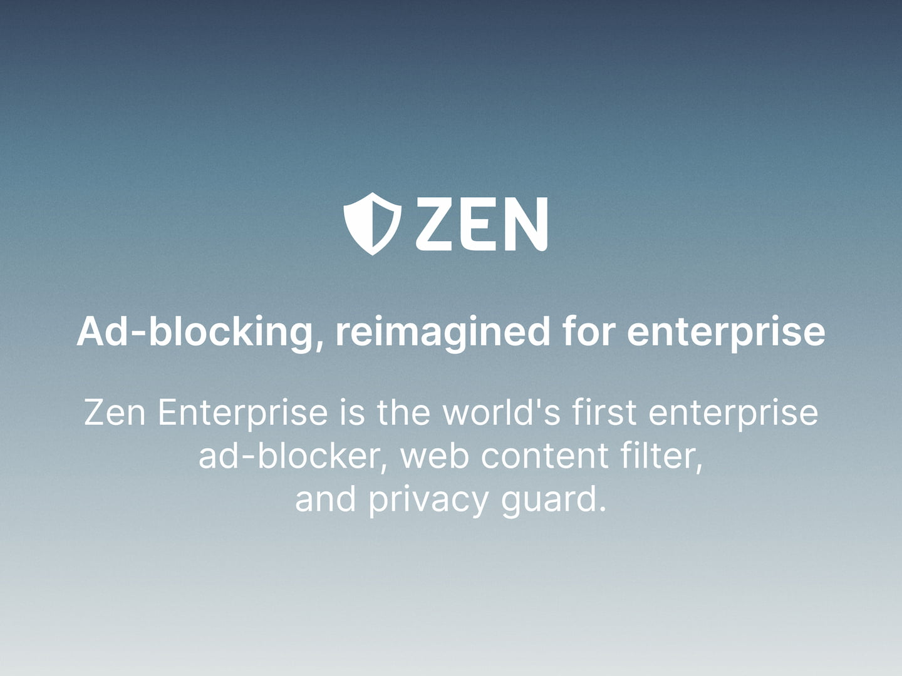
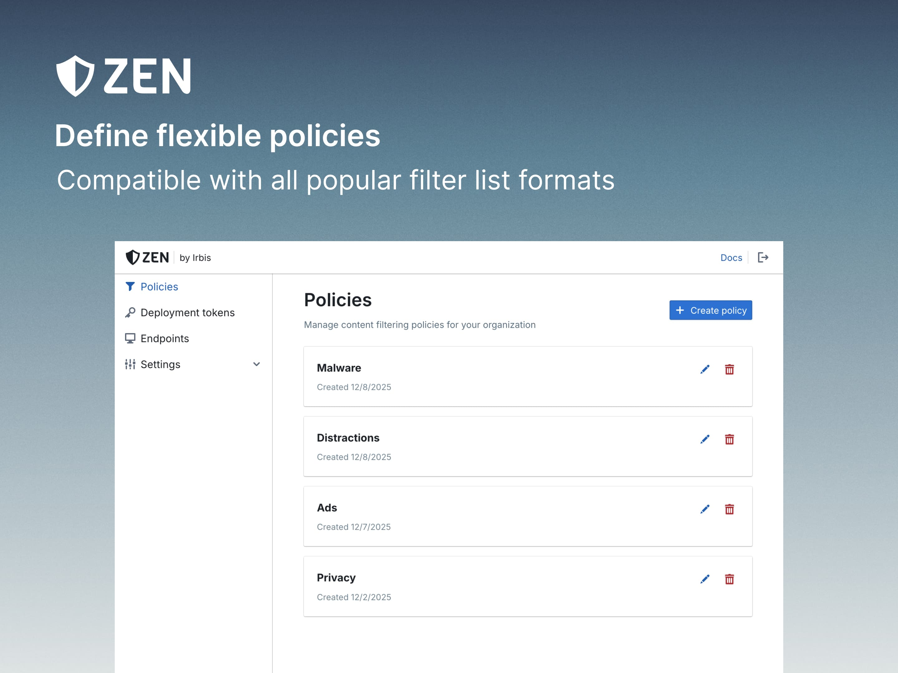
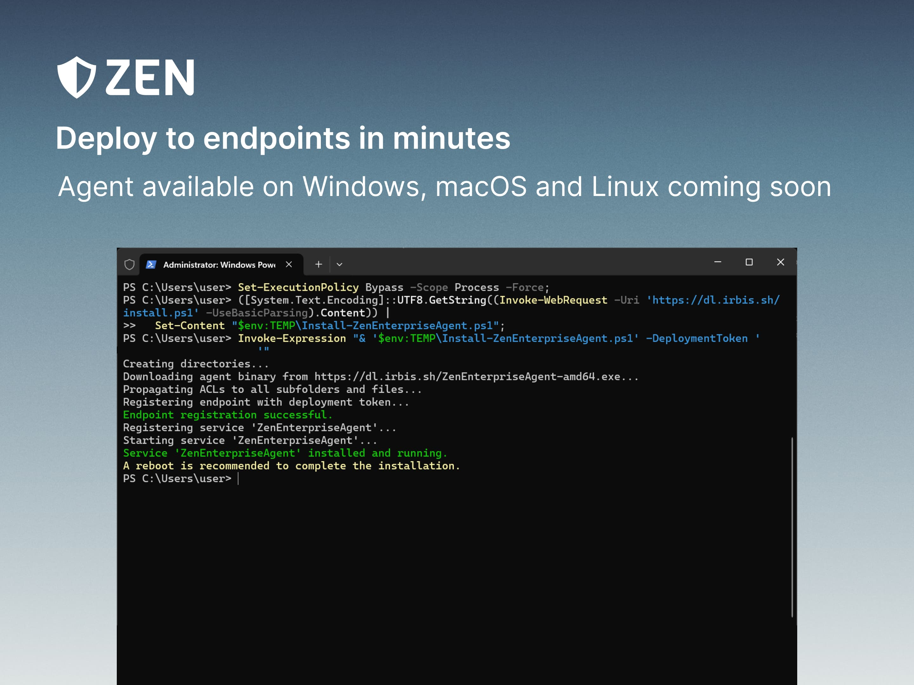

+++
date = '2025-12-08T18:00:00+05:00'
draft = false
author = 'Ansar Smagul'
authorURL = 'https://bsky.app/profile/anfragment.net'
title = 'Announcing Zen Enterprise'
description = "We're announcing Zen Enterprise – a fast, lightweight, and privacy-first way for organizations to protect their teams from ads, trackers, and web-based threats."
image = '/blog/announcing-zen-enterprise/og-image.jpg'
+++

  

Today, we're excited to announce __Zen Enterprise__ – a fast, lightweight, and privacy-first way for organizations to protect their teams from ads, trackers, and web-based threats.

Zen began as a personal tool to make the internet more humane. Over the past two years, it has grown into a project used by thousands of people across the world. Zen Enterprise builds on that foundation and brings the same reliability and efficiency to teams of every size – now with the enterprise-grade controls needed to counter modern threats.

## Why we built Zen Enterprise

Small and mid-sized organizations often rely on traditional firewalls or filtering appliances for protection – yet these tools are expensive, complex, and frequently under-configured. It's common to see hardware firewalls deployed with allow-all rules simply because administrators are overloaded with other responsibilities.

At the same time, __malvertising (malware delivered through ads) has become one of the fastest-growing attack vectors__. According to [Confiant](https://www.confiant.com/maq-index-2025), _"In the first half of 2025, 1 in every 78 ads carried risk, exposing users to scams, malware, and AI-generated deception across tens of thousands of premium sites."_ These threats don't require users to visit suspicious pages; they appear on mainstream, reputable websites, bypassing most traditional perimeter defenses.

And while consumer ad-blockers help individuals, they fall short at the organizational level. They're difficult to manage centrally, can be disabled locally, and often don't work consistently across different browsers or devices.

We built Zen Enterprise to solve these gaps: a simple, dependable layer of protection that works everywhere, is effortless to deploy, and gives teams the control and visibility they need.

## What Zen Enterprise offers

  
  

- __Centralized policy management__ 
  Create and manage filter lists, policies, and custom rules from a single dashboard. Apply them across your organization or tailor them to specific departments.
- __Fast, local protection on every endpoint__ 
  The Zen agent – available on Windows, with macOS and Linux coming coon - runs directly on each device, ensuring consistent filtering no matter where your team is located, and regardless of VPN configuration.
- __Deploy in minutes__ 
  Roll out the agent via MDM/RMM or a simple installer. No dedicated hardware. No network configuration. No downtime.
- __Web based threat prevention__ 
  Blocks malicious ads, tracking beacons, phishing attempts, and other threats before they load. Our flexible rule engine can be adapted to many situations – for example, to remove algorithmic feeds on social media without disrupting legitimate functionality.
- __Network performance improvements__ 
  Reduce bandwidth consumption, CPU overhead, and improve battery life by eliminating heavy ad scripts and background trackers.

## To our amazing community

Our mission hasn't changed: __we're making ad-blocking and privacy more accessible to everyone__. Zen Personal remains free, open-source, and central to what we do.

Introducing a paid enterprise edition strengthens that mission. It gives us the opportunity to continue improving the core technology, expand platform support, and deliver a better experience for all users – not just organizations. Both editions share the same underlying engine, so advances in performance, filtering, and security flow directly into Zen Personal as well.

We're also committed to staying independent. We don't plan to pursue venture capital or chase hyper-scale growth. Zen will remain a mission-driven, people-first project focused on long-term reliability rather than short-term metrics.

Zen Personal is here to stay, and this launch helps ensure it keeps getting better.

## A note about Irbis

As part of this launch, we're also establishing <strong>Irbis</strong>, a new organization that will house and steward the Zen project going forward. Irbis takes its name from the elusive [snow leopard](https://en.wikipedia.org/wiki/Snow_leopard), symbolizing agility, strength, and independence – qualities we strive for in our software and mission.

Zen Personal and Zen Enterprise will both continue to grow under this new home.

## Available today

Zen Enterprise is now live. The platform is free to try during our launch period, and will then cost $1/month per endpoint.

Get started: [https://dash.irbis.sh](https://dash.irbis.sh)

If you'd like a walkthrough or have questions about integration, deployment, or policies, we're here to help – just reach out via [contact@irbis.sh](mailto:contact@irbis.sh) or [community Discord]({}).
